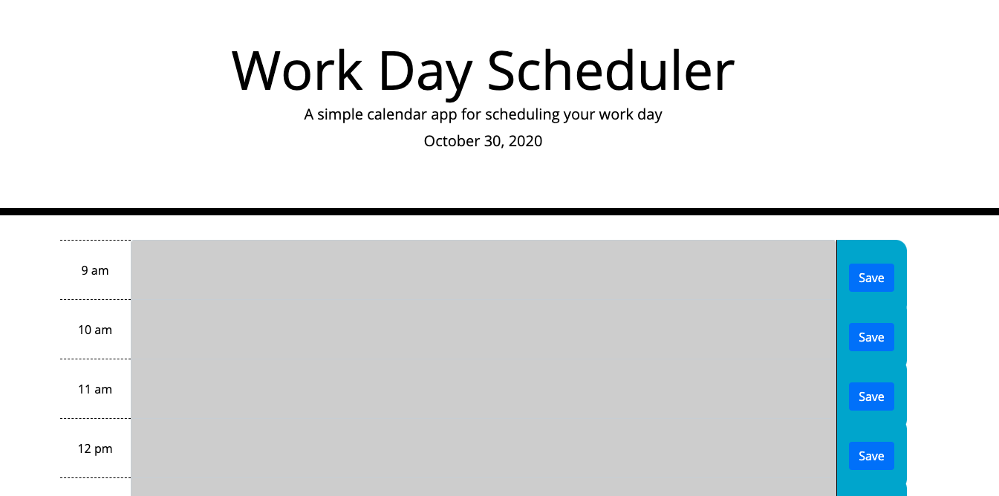

# code-quiz-pbm

This work day scheduler is intended to provide a basic workday scheduler that stores notes in localstorage and updates the timeblocks based on time of day.

# Installation

1. Open Browser
2. Navigate to https://pmo48.github.io/work-day-scheduler-pbm/

# Usages

- Giving 100% on homework
- Displaying jquery logic
- Keeping workdays organized

# Credits

- TRILOGY class for instructions, html and CSS
- Bootstrap - 4.5.3
- jQuery - 3.5.1
- moment.js - 2.29.1

